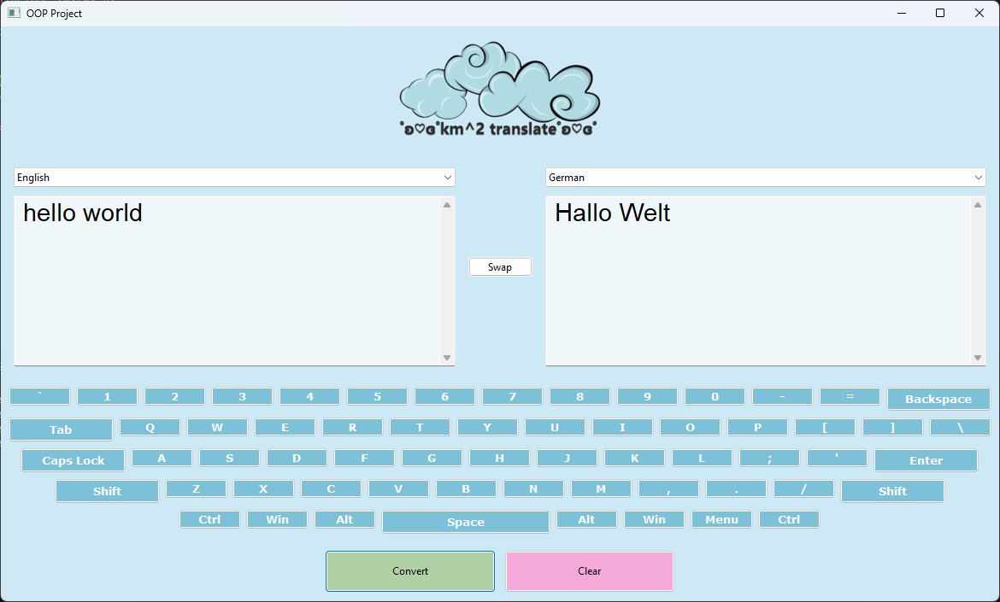

# ☁️ C++ Translation GUI with on-screen Keyboard

A Project designed in 2024 by three girls, dipping their toes into an Object-Oriented Programming course at University. \
Feel free to make any corrections or additions to improve our work!

## 👩‍💻 Team
This project was developed **collaboratively** by:
- Konstantina Spanoudaki
- Maria Psaropa
- Meropi Tsoumani 

All members contributed **equally** to the design, implementation, and testing of the application!

## ✨ Features
- 🌍 Text translation using external API
- ⌨️ Custom on-screen keyboard
- 🖥️ GUI built with wxWidgets
- 🔄 Language selection support
- ⚡ Fast API-based responses

<div align="center">



</div>


## 🛠️ REQUIREMENTS
- C++
- VS Code
- wxWidgets lib
- cURL lib 
- nlohmann/json
- A Translator API

## 🧩 Project Structure
```text
. 
├── 📁 images/
│   ├── example.png     # a simple translating example display
│   └── logo.png        # our (kitsch) logo 🩵
├── CMakeLists.txt      # configuration file 
├── Keyboard.cpp        # on-screen custom keyboard source file 
├── Keyboard.h          # keyboard's header file 
├── Languages.h         # language map
├── MyApp.cpp           # window's implementation source file 
├── MyApp.h             # window's implementation header file 
├── MyFrame.cpp         # main GUI window handling user interactions and API call
├── MyFrame.h           # main GUI header file 
└── README.md           # Documentation
```


## ⚙️ Environment Setup
1. Install Build Tools 
First we need to install the Compiler and CMake: 
- Install Microsoft's Visual Studio Community and select the **"Desktop development with C++"** workload. \
**note:** You don't need to to actively use Visual Studio IDE, installing it simply provides your system with the necessary background tools.

2. IDE Setup
- Install Visual Studio Code.
- Open VS Code and head to the Extensions tab - install the following tools: \
**i.** C/C++ (Microsoft) \
**ii.** CMake Tools (Microsoft) 

3. Install the Dependencies
This application is based on wxWidgets (GUI), cpr (HTTP requests), and nlohmann_json (JSON parsing). The most straightforward way to manage these on Windows is via Microsoft's vcpkg package manager.
- Open your terminal (Command Prompt) and run the following commands:
```bash
git clone https://github.com/microsoft/vcpkg.git
cd vcpkg
bootstrap-vcpkg.bat
vcpkg integrate install
vcpkg install wxwidgets cpr nlohmann-json:x64-windows
```
## 🔨 Build & Run 🏃‍♀️
1. Clone this repository and open the project folder in Visual Studio Code.
2. VS Code will detect the CMakeLists.txt file and prompt you to configure the project. Click **Yes**!
3. When prompted to select a Compiler (Kit), choose "Visual Studio Community ... - amd64".
4. In the bottom status bar of VS Code, click the Build icon(⚙️) to compile the code.
5. Once the build finishes successfully, click the Run icon (▶) right next to it to launch the application!

## 🩷 P.S. - Note 
The API we used can be found [here](https://mymemory.translated.net/doc/spec.php)! \
It is open source and easy to use (GET method). \
We would like to thank the MyMemory Team for the free access and their detailed step by step guide!


